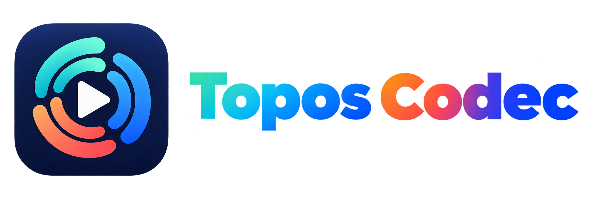
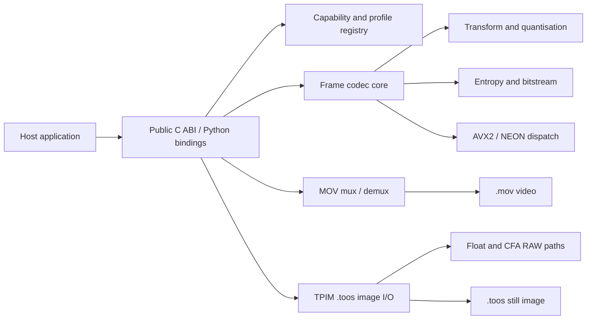

# Topos Codec

<p align="center">
  
</p>

<p align="center"><strong>A systematic, open-source codec family for video, still images, HDR, compositing and RAW workflows.</strong></p>

<p align="center">
  <a href="https://github.com/ToposHub/topos-codec/actions/workflows/codec-matrix.yml"></a>
  <a href="https://github.com/ToposHub/topos-codec/actions/workflows/codec-fuzz.yml"></a>
  <a href="LICENSE"></a>
  <a href="README.zh-CN.md">简体中文</a>
</p>

Topos Codec is a native C11 codec and SDK for production-oriented media pipelines. It provides deterministic intra-frame coding, an optional low-latency inter-frame tier, a MOV-based video container, and the `.toos` still-image format. The same public core is used for video, image, floating-point and CFA RAW paths so applications do not need separate pixel implementations.

> **Preview status:** this repository is currently published as `v0.1.0-preview`. The format, SDK and platform matrix are still evolving. Use the conformance tests and capability manifest as the source of truth before shipping a new integration.

## Why Topos

- **One codec family across the pipeline** — proxies, edit intermediates, grading, VFX, image sequences, HDR and RAW are described by one capability model.
- **High-precision working formats** — 10/12-bit video and image paths, 16-bit extensions, half-float image tiers, and CFA RAW at 12 or 16 bits.
- **Deterministic output** — fixed-QP and sized modes, frozen golden vectors, explicit metadata, and stable error reporting make builds reproducible.
- **Editing-friendly access** — intra tiers provide random frame access; the LP tier adds a small IP-2 micro-GOP for cache and preview workloads.
- **Native performance** — C11 implementation, runtime-dispatched AVX2/NEON kernels, slice-parallel jobs and a bounded thread pool.
- **Open integration surface** — public C ABI, CMake package, command-line tools, Python bindings and format specifications are included in this repository.
- **Graceful failure** — malformed packets are rejected before output, while damaged slices can be concealed with per-slice status for recovery-oriented workflows.

## Format family at a glance

### Video (`.mov`)

| Profile | Coding model | Precision / sampling | Typical use |
| --- | --- | --- | --- |
| **Topos 422 Proxy** | Intra | 10-bit YUV 4:2:2 | Offline proxies and remote editing |
| **Topos 422 LT** | Intra | 10-bit YUV 4:2:2 | Lightweight intermediates and rough cuts |
| **Topos 422** | Intra | 10-bit YUV 4:2:2 | General editing and render caches |
| **Topos 422 HQ** | Intra | 10/12/16-bit; YUV 4:2:2, 4:4:4 or GBR | Grading and mastering intermediates |
| **Topos 4444** | Intra | 10/12/16-bit 4:4:4 or GBR, optional alpha | VFX and motion graphics |
| **Topos 4444 XQ** | Intra | 12-bit 4:4:4 or GBR, optional alpha | HDR and multi-generation finishing |
| **Topos 422 LP** | IP-2 micro-GOP | 10-bit YUV 4:2:2, no alpha | Fast preview and transcode caches |
| **Topos RAW** | Intra CFA | 12/16-bit Bayer phase planes, no alpha | RAW-to-RAW camera intermediates |

Video profiles share the MOV container and in-band geometry, color, range, alpha and transfer metadata. Exact target rates, QP ranges and profile bytes are maintained in the [capability manifest](native/docs/capability_manifest.json) and [video whitepaper](Topos_Codec_Whitepaper.md).

### Still images (`.toos`)

| Family | Available tiers | Encoded sample domain | Intended use |
| --- | --- | --- | --- |
| **Topos 422** | Low / Medium / High / Ultra | 10-bit YUV 4:2:2 | Review, image sequences and editorial caches |
| **Topos 444** | High / Ultra | 10 or 12-bit GBR 4:4:4 | Compositing and high-fidelity image work |
| **Topos float** | Low / Medium / High / Ultra | 16-bit half float | Linear HDR and compositing intermediates |
| **Topos RAW** | 12-bit or 16-bit × 2:1 / 4:1 / 6:1 / 8:1 / 12:1 / 16:1 | CFA phase planes | Camera RAW image sequences and archives |

The `.toos` format uses a TPIM envelope around the same frame coding core as video. It supports explicit alpha semantics, GBR pass-through, atomic file writes and sequence-oriented workflows. Float32 buffers can be supplied by applications at the API boundary; the currently encoded float tiers are half-float (`float16`). See the [image whitepaper](Topos_Image_Whitepaper.md) for the complete 22-tier registry.

## Standard brand assets

The repository uses these two supplied assets as the standard Topos Codec marks:

| Asset | Use |
| --- | --- |
| [`topos-codec-logo-1.png`](docs/media/topos-codec-logo-1.png) | Square icon |
| [`topos-codec-logo-2.png`](docs/media/topos-codec-logo-2.png) | Horizontal wordmark (`Topos Codec`) |

Both files preserve their original RGBA transparency.

## Visual reference

The following project artwork is included for repository and documentation use. The comparison is a representative rate-matched test image; it is not a universal quality claim. Reproduce measurements with the benchmark reports and your own source material.

<p align="center">
  
</p>

## SDK surface

| Surface | Location | What it provides |
| --- | --- | --- |
| C ABI | `native/include/topos_codec.h` | Frame encode/decode, sized rate control, metadata, capability queries and error codes |
| Image ABI | `native/include/topos_image.h` | `.toos` read/write, float and CFA RAW metadata, alpha and sequence helpers |
| CMake package | `native/cmake/` | `find_package(ToposCodec CONFIG REQUIRED)` for native applications |
| Python bindings | `python/topos_codec/` | ctypes bindings, profile registry, high-level encoder and image helpers |
| CLI tools | `native/src/cli/` | Inspection, probing, encoding, decoding, RAW generation and quality reports |
| Specifications | `docs/`, `Topos_*_Whitepaper.md` | Bitstream, MOV container, image envelope, ADRs and benchmark methodology |

The public ABI is designed for long-lived integrations: structures carry `struct_size`, enumerations are capability-queryable, and unsupported combinations fail explicitly instead of silently falling back.

## Quick start

### Build the native SDK

```bash
cmake -S native -B build/release -DCMAKE_BUILD_TYPE=Release
cmake --build build/release --parallel
ctest --test-dir build/release --output-on-failure
```

Run the complete local gate, including sanitizers, conformance, fuzz replay, CLI paths and binding smoke tests:

```bash
bash native/run_tests.sh
```

### Install the Python package

Build the native library first, then either point the bindings at it or copy it into the package:

```bash
TOPOS_CODEC_LIB="$PWD/build/release/libtopos_codec.dylib" \
  PYTHONPATH=python python3 native/examples/topos_roundtrip.py

python3 -m pip install .
```

On Linux use the generated `.so`; on Windows use the generated `.dll`. Bundled wheels are platform-specific and are built after the native library is available. See [docs/SDK.md](docs/SDK.md) for CMake, C, Python and packaging examples.

### Inspect and measure

```bash
build/release/topos_inspect <frame-packet>
build/release/topos_quality report
build/release/topos_quality sweep
```

## Architecture



The core is deliberately independent of FFmpeg and other third-party codec libraries. Applications may add their own container, demosaic, color-management or host-API layers around the stable C ABI.

## Validation and quality evidence

- Native unit, conformance, golden-vector, fuzz-replay, ABI and CLI tests are part of the repository gate.
- The current preview snapshot has passed the local CTest matrix on macOS; run the commands above for the exact result on your platform.
- Benchmark reports include Topos-vs-ProRes bitrate measurements, decode/encode timings and image-size comparisons. These reports are workload-specific and should be read together with their source manifests.
- The [capability manifest](native/docs/capability_manifest.json) is the single source of truth for advertised profiles. Update it before changing a public capability.

## Documentation map

- [Video whitepaper](Topos_Codec_Whitepaper.md) · [中文视频白皮书](Topos_Codec_白皮书.md)
- [Image whitepaper](Topos_Image_Whitepaper.md) · [中文图片白皮书](Topos_Image_白皮书.md)
- [SDK integration guide](docs/SDK.md)
- [Bitstream specification v1](docs/bitstream_spec_v1.md)
- [MOV container specification](docs/container_spec_v1.md)
- [Capability manifest](native/docs/capability_manifest.json)
- [Benchmark protocol](native/docs/benchmark_protocol.md)
- [ProRes bitrate comparison](docs/topos_prores_bitrate_comparison_2026-09-07.md)
- [Image-size comparison](docs/topos_image_size_comparison_2026-09-07.md)
- [Architecture decisions](docs/ADR-INDEX.md)

## Current scope and limitations

Topos Codec is a preview release. Some host integrations, signed binary distribution, wide-format RAW ingest and cross-platform performance baselines are still being expanded. Topos RAW stores CFA phase planes; debayering and camera-specific color science remain application responsibilities. Comparisons with ProRes or other formats are engineering measurements from the cited test setup, not vendor certification or a claim of universal superiority.

## Contributing

Issues and pull requests are welcome. For format or ABI changes, start with an ADR and update the capability manifest, specifications, golden vectors and tests in the same change. Keep new public behavior documented in both the relevant whitepaper and the SDK guide.

## License and trademarks

The source code is released under the [Apache License 2.0](LICENSE), with additional notices in [NOTICE](NOTICE).

Topos Codec is an independent project. Apple, ProRes, QuickTime, Avid, DaVinci Resolve and other product names remain the trademarks of their respective owners; they are referenced only for compatibility and comparative context.
