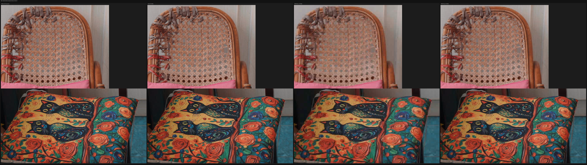
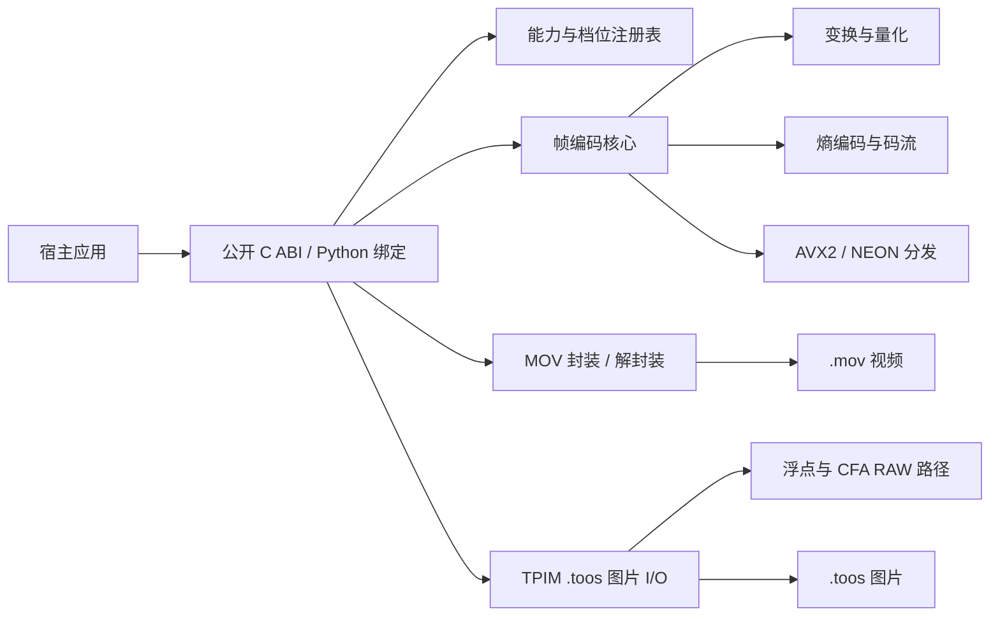

# Topos Codec

<p align="center">
  <picture>
    <source media="(prefers-color-scheme: dark)" srcset="docs/media/topos-codec-icon-dark.png">
    <source media="(prefers-color-scheme: light)" srcset="docs/media/topos-codec-icon-light.png">
    
  </picture>
</p>

<p align="center"><strong>面向视频、静态图片、HDR、合成与 RAW 工作流的体系化开源编码方案。</strong></p>

<p align="center">
  <a href="README.md">English</a>
  <a href="https://github.com/ToposHub/topos-codec/actions/workflows/codec-matrix.yml"></a>
  <a href="LICENSE"></a>
</p>

Topos Codec 是一个面向实际媒体制作流程的原生 C11 编码器与 SDK。项目提供确定性的帧内编码、可选的低延迟帧间档、基于 MOV 的视频容器，以及 `.toos` 静态图片格式。视频、图片、浮点和 CFA RAW 路径共用同一套公开核心，应用不需要维护多套像素编码实现。

> **预览状态：** 当前仓库版本为 `v0.1.0-preview`。格式、SDK 和平台支持矩阵仍在持续完善。接入新能力前，请以一致性测试和能力清单为准。

## 设计重点

- **一套体系覆盖完整流程**：代理、剪辑中间片、调色、VFX、图片序列、HDR 和 RAW 使用统一能力模型。
- **高精度工作格式**：支持 10/12-bit 视频与图片路径、16-bit 扩展、半浮点图片档，以及 12/16-bit CFA RAW。
- **确定性输出**：提供固定 QP、目标码率、冻结 golden vector、显式元数据和稳定错误码，便于复现与回归。
- **适合剪辑与合成**：帧内档支持随机访问；LP 档使用小型 IP-2 micro-GOP，适合缓存和预览。
- **原生性能路径**：C11 实现、AVX2/NEON 运行时分发、条带并行和有界线程池。
- **开放 SDK 接口**：包含稳定 C ABI、CMake 包、命令行工具、Python 绑定和格式规范。
- **可诊断的错误处理**：坏包在产生输出前被拒绝；损坏 slice 可按 slice 进行 concealment，并返回状态。

## 格式总览

### 视频（`.mov`）

| 档位 | 编码模型 | 精度 / 采样 | 典型用途 |
| --- | --- | --- | --- |
| **Topos 422 Proxy** | 帧内 | 10-bit YUV 4:2:2 | 离线代理、远程剪辑 |
| **Topos 422 LT** | 帧内 | 10-bit YUV 4:2:2 | 轻量中间片、粗剪 |
| **Topos 422** | 帧内 | 10-bit YUV 4:2:2 | 常规剪辑、渲染缓存 |
| **Topos 422 HQ** | 帧内 | 10/12/16-bit；YUV 4:2:2、4:4:4 或 GBR | 调色、中间母版 |
| **Topos 4444** | 帧内 | 10/12/16-bit 4:4:4 或 GBR，可选 Alpha | VFX、动态图形、合成 |
| **Topos 4444 XQ** | 帧内 | 12-bit 4:4:4 或 GBR，可选 Alpha | HDR、多代制作 |
| **Topos 422 LP** | IP-2 micro-GOP | 10-bit YUV 4:2:2，不带 Alpha | 快速预览、转码缓存 |
| **Topos RAW** | CFA 帧内 | 12/16-bit Bayer 相位平面，不带 Alpha | RAW→RAW 相机中间片 |

视频档位统一使用 MOV 容器，并在文件内记录几何、色彩、范围、Alpha 和传输特性元数据。目标码率、QP 范围和 profile 字节以[能力清单](native/docs/capability_manifest.json)和[视频白皮书](Topos_Codec_白皮书.md)为准。

### 静态图片（`.toos`）

| 家族 | 可用档位 | 编码样本域 | 典型用途 |
| --- | --- | --- | --- |
| **Topos 422** | Low / Medium / High / Ultra | 10-bit YUV 4:2:2 | 审片、图片序列、剪辑缓存 |
| **Topos 444** | High / Ultra | 10 或 12-bit GBR 4:4:4 | 合成、高保真图片 |
| **Topos float** | Low / Medium / High / Ultra | 16-bit half float | 线性 HDR、合成中间片 |
| **Topos RAW** | 12-bit 或 16-bit × 2:1 / 4:1 / 6:1 / 8:1 / 12:1 / 16:1 | CFA 相位平面 | 相机 RAW 图片序列、归档 |

`.toos` 使用 TPIM 信封包裹与视频相同的帧编码核心，支持明确的 Alpha 语义、GBR 直通、原子写入和序列工作流。应用可以在 API 边界使用 Float32 缓冲；当前落盘的浮点档是 half-float（`float16`）。完整 22 档注册表见[图片白皮书](Topos_Image_白皮书.md)。

## 画质参考

下图是仓库中附带的代表性码率匹配测试图。它用于说明测试方法和视觉检查方式，不代表所有素材、分辨率和档位都能得到相同结果；请结合基准报告和自己的母版重新测量。

<p align="center">
  
</p>

## SDK 组成

| 接口层 | 路径 | 能力 |
| --- | --- | --- |
| C ABI | `native/include/topos_codec.h` | 帧编解码、目标码率、元数据、能力查询、错误码 |
| 图片 ABI | `native/include/topos_image.h` | `.toos` 读写、浮点与 CFA RAW 元数据、Alpha、序列辅助接口 |
| CMake 包 | `native/cmake/` | 原生项目使用 `find_package(ToposCodec CONFIG REQUIRED)` |
| Python 绑定 | `python/topos_codec/` | ctypes 绑定、档位注册表、高级编码和图片辅助接口 |
| CLI 工具 | `native/src/cli/` | 检查、探测、编码、解码、RAW 生成、质量报告 |
| 规范与报告 | `docs/`、`Topos_*_Whitepaper.md` | 码流、MOV、图片信封、ADR 和基准方法 |

公开 ABI 使用 `struct_size`、能力查询和显式错误返回设计，未知或不支持的组合会明确失败，不会静默降级。

## 快速开始

### 构建原生 SDK

```bash
cmake -S native -B build/release -DCMAKE_BUILD_TYPE=Release
cmake --build build/release --parallel
ctest --test-dir build/release --output-on-failure
```

运行完整本地门禁（包括 sanitizer、一致性、fuzz 回放、CLI、ABI 和绑定冒烟测试）：

```bash
bash native/run_tests.sh
```

### 安装 Python 包

先构建原生库，然后通过环境变量指定，或把库复制到 Python 包目录：

```bash
TOPOS_CODEC_LIB="$PWD/build/release/libtopos_codec.dylib" \
  PYTHONPATH=python python3 native/examples/topos_roundtrip.py

python3 -m pip install .
```

Linux 使用生成的 `.so`，Windows 使用生成的 `.dll`。打包 wheel 时需要先生成对应平台的原生库。完整 CMake、C、Python 和发布示例见 [docs/SDK.md](docs/SDK.md)。

### 检查与测量

```bash
build/release/topos_inspect <frame-packet>
build/release/topos_quality report
build/release/topos_quality sweep
```

## 架构



核心实现不依赖 FFmpeg 或其他第三方编码库。应用可以在稳定 C ABI 之上添加自己的封装、去马赛克、色彩管理和宿主 API 层。

## 验证与证据

- 仓库门禁覆盖原生单元、一致性、golden vector、fuzz 回放、ABI 和 CLI 路径。
- 当前预览快照已在 macOS 上通过本地 CTest 矩阵；在目标平台运行上面的命令可得到准确结果。
- 基准报告包含 Topos 与 ProRes 的码率、编解码时间和图片体积对比。报告只对其测试素材和环境负责，应结合源清单阅读。
- [能力清单](native/docs/capability_manifest.json)是对外声明能力的单一真相源。新增公开能力前应先更新它。

## 文档导航

- [视频白皮书](Topos_Codec_白皮书.md) · [Video whitepaper](Topos_Codec_Whitepaper.md)
- [图片白皮书](Topos_Image_白皮书.md) · [Image whitepaper](Topos_Image_Whitepaper.md)
- [SDK 接入指南](docs/SDK.md)
- [码流规范 v1](docs/bitstream_spec_v1.md)
- [MOV 容器规范](docs/container_spec_v1.md)
- [能力清单](native/docs/capability_manifest.json)
- [基准方法](native/docs/benchmark_protocol.md)
- [ProRes 码率对比](docs/topos_prores_bitrate_comparison_2026-09-07.md)
- [图片体积对比](docs/topos_image_size_comparison_2026-09-07.md)
- [架构决策记录](docs/ADR-INDEX.md)

## 当前范围与限制

Topos Codec 目前是预览版本。部分宿主集成、签名二进制分发、更多 RAW 输入格式和跨平台性能基线仍在完善。Topos RAW 保存的是 CFA 相位平面，去马赛克与相机色彩科学由应用层负责。与 ProRes 或其他格式的对比是指定测试环境下的工程测量，不是厂商认证，也不构成对所有素材都更优的承诺。

## 参与贡献

欢迎提交 Issue 和 Pull Request。涉及格式或 ABI 的改动，应先建立 ADR，并在同一变更中更新能力清单、规范、golden vector 和测试。新的公开行为应同时补充对应白皮书和 SDK 指南。

## 许可证与商标

源代码使用 [Apache License 2.0](LICENSE)，附加声明见 [NOTICE](NOTICE)。

Topos Codec 是独立项目。Apple、ProRes、QuickTime、Avid、DaVinci Resolve 等名称归其各自权利人所有，本文仅用于兼容性与对比说明。
